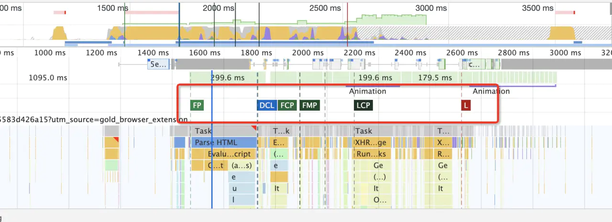

# 性能指标

Chrome Devtool Performance 是大家常用的页面性能分析工具，当你使用它来分析页面加载性能的时候会生成如下图所示的报告。图中包含了以下几个重要的时间点：DCL, L, FP, FCP, FMP, LCP。

## DCL(DOMContentLoaded)

大多数时候，当初始的 HTML 文档被完全加载和解析完成之后，DOMContentLoaded 事件被触发，而无需等待样式表、图像和子框架的完全加载。

而不在 Body 底部的 JavaScript 可以阻塞 DOM 的生成，也就是说当浏览器在解析 HTML 文档时，如果遇到 `<script>`，便会停下对 HTML 文档的解析，转而去处理脚本。如果脚本是内联的，浏览器会先去执行这段内联的脚本，如果是外链的，那么先会去加载脚本，然后执行。在处理完脚本之后，浏览器便继续解析 HTML 文档。另外，因为 JavaScript 可以查询任意对象的样式，所以意味着在 CSS 解析完成，也就是 CSSOM 生成之后，JavaScript 才可以被执行。

总结：当文档中没有脚本时，浏览器解析完文档便能触发 DOMContentLoaded 事件；如果文档中包含内联脚本，则脚本会阻塞文档的解析，而脚本需要等 CSSOM 构建完成才能执行。

参考： ./testDemo/test-DOMContentLoaded.html

### defer 与 DOMContentLoaded

如果 script 标签中包含 defer，那么这一块脚本将不会影响 HTML 文档的解析，而是等到 HTML 解析完成后才会执行。而 **DOMContentLoaded 只有在 defer 脚本执行结束后才会被触发**。 所以这意味着什么呢？HTML 文档解析不受影响，等 DOM 构建完成之后 defer 脚本执行，但脚本执行之前需要等待 CSSOM 构建完成。在 DOM、CSSOM 构建完毕，defer 脚本执行完成之后，DOMContentLoaded 事件触发。

### async 与 DOMContentLoaded

如果 script 标签中包含 async，则 HTML 文档构建不受影响，解析完毕后，DOMContentLoaded 触发，而不需要等待 async 脚本执行、样式表加载等等。

## FCP(First Contentful Paint)
